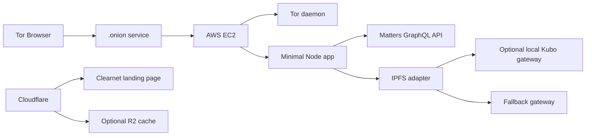

# Architecture

## Product Shape

Matters Onion Gateway is a small onion access gateway. It is not a platform fork and not a full mirror.

The gateway keeps Matters as the canonical identity, publishing, and content layer. It adds a safer access path for users who prefer Tor.

## System Overview



## Components

### Onion Service

Runs on AWS EC2 through Tor daemon.

Responsibilities:

- Own the `.onion` address
- Keep the onion private key on the instance
- Route onion traffic to the local app

### Minimal Node App

Recommended stack:

- Node.js
- Hono or Fastify
- Server-rendered HTML
- No React or Next.js for MVP
- One CSS file
- Mature HTML sanitizer

Responsibilities:

- Render minimal pages
- Manage login session
- Call Matters GraphQL
- Sanitize article HTML
- Rewrite or proxy media
- Serve IPFS adapter routes

### Matters GraphQL Client

The gateway should call existing Matters GraphQL operations for:

- Login
- Viewer
- Article lookup
- My articles
- My bookmarks

All GraphQL operations must be centralized in one module so upstream schema changes are easy to handle.

### IPFS Adapter

The adapter should support:

- `GET /ipfs/{cid}`
- Local Kubo gateway first, if installed
- Short timeout
- Fallback gateway second
- Clear error page if CID is unavailable

MVP does not pin all content.

### Cloudflare

Cloudflare is optional.

Suitable use:

- Clearnet landing page
- DNS
- Status page
- Optional R2 storage for public static files

Not suitable for MVP:

- Primary onion hosting
- Tor daemon replacement
- Storing session secrets

## Request Flow

### Article Read

```text
User enters Matters URL or hash
Gateway parses identifier
Gateway queries Matters GraphQL
Gateway displays metadata and IPFS CID
Gateway renders sanitized HTML fallback
Gateway proxies or blocks external media
```

### Login

```text
User submits credentials over onion
Gateway calls Matters login mutation
Gateway stores short-lived session
Gateway uses session token for later GraphQL calls
Gateway never stores credentials
```

## Data Storage

MVP should avoid persistent storage unless needed.

Allowed storage:

- Encrypted session cookie
- Optional SQLite for non-sensitive cache
- Optional local cache for proxied images

Forbidden storage:

- User passwords
- Long-lived access tokens
- Private article contents
- Raw GraphQL request bodies
- Full reading history

## Default Routes

```text
GET  /
GET  /login
POST /login
POST /logout
GET  /article
GET  /article/:shortHash
GET  /ipfs/:cid
GET  /me/articles
GET  /me/bookmarks
GET  /proxy/image
GET  /healthz
```
