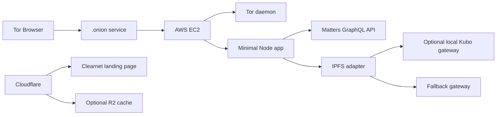

# Architecture

## Product Shape

Matters Onion Gateway is a small anonymous onion reader. It is not a platform fork and not a full mirror.

The gateway keeps Matters as the canonical publishing and content layer. It adds a safer read-only access path for users who prefer Tor.

## System Overview



## Components

### Onion Service

Runs on AWS EC2 through Tor daemon.

Responsibilities:

- Own the `.onion` address
- Keep the onion private key on the instance
- Route onion traffic to the local app

### Minimal Node App

Recommended stack:

- Node.js
- Hono or Fastify
- Server-rendered HTML
- No React or Next.js for MVP
- One CSS file
- Mature HTML sanitizer

Responsibilities:

- Render minimal pages
- Call Matters GraphQL
- Sanitize article HTML
- Rewrite or proxy media
- Serve IPFS adapter routes
- Serve an RSS feed of the public home feed
- Advertise the onion via `Onion-Location` on clearnet responses
- Report app and upstream status from `/healthz`
- Cap concurrent upstream requests and cache feeds briefly in memory

### Matters GraphQL Client

The gateway should call existing Matters GraphQL operations for anonymous public article lookup.

All GraphQL operations must be centralized in one module so upstream schema changes are easy to handle.

### IPFS Adapter

The adapter should support:

- `GET /ipfs/{cid}`
- Local Kubo gateway first, if installed
- Short timeout
- Fallback gateway second
- Clear error page if CID is unavailable

MVP does not pin all content.

### Cloudflare

Cloudflare is optional.

Suitable use:

- Clearnet landing page
- DNS
- Status page
- Optional R2 storage for public static files

Not suitable for MVP:

- Primary onion hosting
- Tor daemon replacement

## Request Flow

### Article Read

```text
User enters Matters URL or hash
Gateway parses identifier
Gateway queries Matters GraphQL
Gateway displays metadata and IPFS CID
Gateway renders sanitized HTML fallback
Gateway proxies or blocks external media
Gateway renders version history with per-version IPFS CIDs when revised
Gateway renders read-only comments and related articles
```

noindex articles are hidden everywhere, including direct hash lookup.

### Anonymous Discovery

```text
User opens onion home page
Gateway queries public Matters channels
Gateway samples channel article lists
Gateway deduplicates and sorts sampled public articles by creation time
Gateway renders links to sanitized article pages
```

```text
User searches a keyword
Gateway sends anonymous Matters GraphQL search with record=false
Gateway filters non-public or inactive articles
Gateway renders links to sanitized article pages
```

```text
User uses the single discovery field
Gateway parses article URLs, short hashes, media hashes, and IPFS CIDs first
Gateway tries exact author lookup second
Gateway tries exact tag lookup third
Gateway falls back to anonymous article, author, and tag search
Gateway renders public article, author, and tag results
```

### Localization

```text
Default UI language: Traditional Chinese
Simplified Chinese UI: ?lang=zh-Hans or zh-CN/zh-Hans Accept-Language
English UI: ?lang=en or English Accept-Language
Language state is carried in URLs and hidden form fields
No language cookie or user profile is stored
```

### Design System

The frontend uses the `thematters/design-system` static consumption model:

- Use design tokens and component behavior as CSS references
- Keep one server-rendered HTML app
- Avoid React runtime and bundling for the onion MVP
- Prefer Button, TextField, Avatar, and ArticleCard patterns that can be represented with static HTML/CSS
- Use Matters Studio prompt guidance for text-free editorial hero illustration assets
- Keep the hero art square and in the Matters RSS / Studio announcement visual family: soft cream and light green atmosphere, paper texture, abstract signal paths, and subtle purple / lime accents

## Data Storage

MVP should avoid persistent storage.

Allowed storage:

- Optional SQLite for non-sensitive cache
- Optional local cache for proxied images

Forbidden storage:

- User passwords
- Long-lived access tokens
- Private article contents
- Raw GraphQL request bodies
- Full reading history

## Default Routes

```text
GET  /
GET  /discover
GET  /search
GET  /author
GET  /author/:userName
GET  /channel/:shortHash
GET  /tag/:tagId
GET  /article
GET  /article/:shortHash
GET  /ipfs/:cid
GET  /proxy/image
GET  /feed.xml
GET  /healthz
```

List routes (`/search`, `/channel/:shortHash`, `/author/:userName`, `/tag/:tagId`)
accept an `?after=` cursor for link-based pagination. No client JavaScript and no
cookies are used; the cursor and language travel in the URL.
